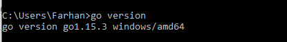
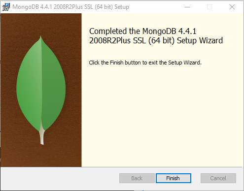

# Install Go, MySQL dan MongoDB

## Install Go 
1. Download GO Installer melalui [Golang](https://golang.org/doc/install)

2. Install GO sesuai gambar dibawah, klik next untuk setiap stepnya. Tunggu hingga proses installasi selesai lalau klik finish.

3. Check versi Go

## Install MySQL
1. Download GO Installer melalui (MySQL)[https://dev.mysql.com/downloads/installer/]

2. Install MySQL sesuai gambar dibawah, klik next untuk setiap stepnya. Tunggu hingga proses installasi selesai lalau klik finish.

3. Check versi MySQL

## Install MongoDB
1. Download MongoDB Installer melalui [MongogDB][(https://www.mongodb.com/try/download/community?tck=docs_server)

2. Install MongoDB sesuai gambar dibawah, klik next untuk setiap stepnya. Tunggu hingga proses installasi selesai 
lalu klik finish.

3. Check versi MongoDB

## Program untuk mambaca data pada database MySQL dan MongoDB
1. Pastikan driver MySQL dan MongoDB connector sudah terinstall

2. Program untuk mengambil data dengan MySQL sebagai [berikut](code/mysql.go)

3. Hasil membaca data dari MySQL menggunakan program

4. Program untuk mengambil data dengan MongoDB sebagai [berikut](code/mongo.go)

5. Hasil membaca data dari MySQL menggunakan program

